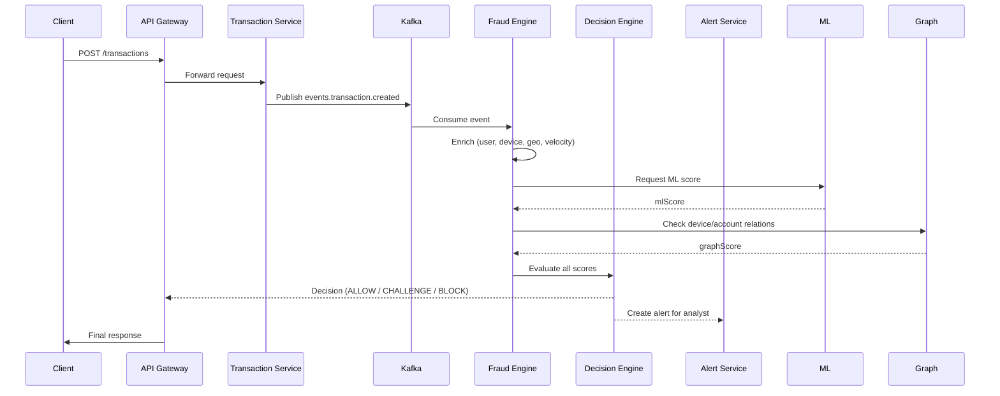

# **Arsitektur Teknis Microservices — Anti-Fraud System (NestJS / Kafka / Turborepo)**

Dokumentasi ini menjelaskan bagaimana **fraud** dicegah dan dideteksi menggunakan pendekatan **microservices**, **event-driven**, dan **scalable**.
Cocok untuk fintech, marketplace, banking, payment gateway, dan B2C apps dengan risiko tinggi.

---

# **1. Gambaran Umum Arsitektur**

Berikut daftar layanan (microservices) yang membentuk arsitektur anti-fraud:

### **Core Services**

1. **api-gateway**
2. **auth-service**
3. **user-service**
4. **transaction-service**
5. **fraud-service (Fraud Engine)**
6. **device-service (Device Fingerprint)**
7. **graph-service (Graph/Relationship Analysis)**
8. **alert-service (Forensic & Analyst UI)**
9. **ingest-service (Stream Processor / Enrichment)**
10. **ml-service (Model Serving)**
11. **audit-logging-service**

### **Infra & Observability**

* Kafka, Redis, Postgres, Neo4j
* Prometheus, Grafana, Jaeger, Loki
* K8s + Helm + Horizontal Scaling

---

# **2. Struktur Monorepo (Turborepo)**

```
/repo
  apps/
    api-gateway/
    auth-service/
    user-service/
    transaction-service/
    fraud-service/
    device-service/
    graph-service/
    alert-service/
    ingest-service/
    ml-service/
  packages/
    shared-dto/
    shared-db/
    kafka-client/
    logger/
    rules-engine/
    ml-client/
    security-utils/
  infra/
    k8s/
    helm/
    terraform/
  docs/
    fraud-rules.md
    event-specs.md
```

---

# **3. Spesifikasi Event Kafka & Schema JSON**

## **Topic Penting:**

* `events.auth.login.attempt`
* `events.transaction.created`
* `events.device.seen`
* `events.fraud.decisions`
* `events.feature.enriched`
* `events.user.created`

---

### **Contoh Event Login Attempt**

```json
{
  "eventId": "uuid",
  "ts": "2025-12-05T08:00:00Z",
  "userId": "user-123",
  "ip": "203.0.113.5",
  "userAgent": "Mozilla/5.0",
  "deviceId": "dfp-abc123",
  "success": false,
  "failureReason": "invalid_password",
  "geo": { "country": "ID", "city": "Jakarta" },
  "meta": { "attemptCountWindow": 12 }
}
```

---

### **Contoh Event Transaksi**

```json
{
  "eventId": "uuid",
  "transactionId": "tx-456",
  "userId": "user-123",
  "amount": 1500000,
  "currency": "IDR",
  "recipientAccount": "9876543210",
  "ip": "198.51.100.4",
  "deviceId": "dfp-abc123",
  "context": {
    "sessionDurationSec": 30,
    "previousActionsNMin": 3
  }
}
```

---

### **Contoh Event Keputusan Fraud**

```json
{
  "decisionId": "uuid",
  "riskScore": 87,
  "matchedRules": ["high_amount", "new_device"],
  "mlScore": 0.82,
  "decision": "CHALLENGE",
  "action": { "type": "OTP" }
}
```

---

# **4. Skema Database (Postgres)**

### **Tabel Users**

```sql
CREATE TABLE users (
  id uuid PRIMARY KEY,
  email text UNIQUE,
  phone text,
  kyc_status varchar(32),
  status varchar(32) DEFAULT 'active',
  created_at timestamptz DEFAULT now()
);
```

### **Tabel Transactions**

```sql
CREATE TABLE transactions (
  id uuid PRIMARY KEY,
  user_id uuid REFERENCES users(id),
  amount bigint,
  currency varchar(8),
  recipient_account text,
  status varchar(32),
  metadata jsonb,
  created_at timestamptz DEFAULT now()
);
```

### **Tabel Device Fingerprint**

```sql
CREATE TABLE device_fingerprints (
  id text PRIMARY KEY,
  user_id uuid,
  first_seen timestamptz,
  last_seen timestamptz,
  attributes jsonb
);
```

### **Tabel Fraud Events**

```sql
CREATE TABLE fraud_events (
  id uuid PRIMARY KEY,
  event_type text,
  risk_score int,
  ml_score numeric,
  decision text,
  matched_rules text[],
  payload jsonb,
  created_at timestamptz DEFAULT now()
);
```

---

# **5. Fraud Rules (DSL) + Evaluasi**

### **Rule JSON**

```json
{
  "id": "high_amount",
  "conditions": {
    "all": [
      { "fact": "transaction.amount", "operator": ">", "value": 1000000 },
      { "fact": "user.risk_level", "operator": "==", "value": "low" }
    ]
  },
  "score": 40,
  "action": "increase_risk"
}
```

### **Evaluator Pseudocode**

```ts
function evaluate(rules, facts) {
  let matches = [];
  let totalScore = 0;

  for (rule of rules) {
    if (rule.conditions.all.every(c => compare(get(facts, c.fact), c.operator, c.value))) {
      matches.push(rule.id);
      totalScore += rule.score;
    }
  }

  return { matches, totalScore };
}
```

---

# **6. Alur Kerja Fraud Engine**

1. Konsumsi event dari Kafka (login / transaksi).
2. Enrichment:

   * GeoIP
   * User profile
   * Device fingerprint
   * Velocity counter (Redis)
3. Ekstraksi fitur (history, avg, session)
4. Evaluasi rule-engine
5. Panggil ML untuk mendapat `mlScore`
6. Query Graph DB (device → user → IP)
7. Hitung `riskScore`
8. Kirim keputusan:

   * ALLOW
   * BLOCK
   * CHALLENGE (OTP / KYC / selfie)
9. Simpan audit log
10. Kirim alert ke analyst UI

---

# **7. Sequence — Transaksi Anti-fraud**



---

# **8. Scaling & High Availability**

### **Fraud-service**

* Stateless worker
* Horizontal scaling via consumer groups
* Redis untuk rate & velocity

### **Graph DB**

* Gunakan Neo4j cluster
* Query berat dipindah ke batch processor jika perlu

### **ML Service**

* Deploy via KServe / Seldon (autoscaling)

### **Kafka**

* Replication factor ≥ 3
* Partition key = userId

---

# **9. Observability & Metrics**

### **Metrics penting (Prometheus)**

* `fraud_decisions_total{decision=}`
* `rule_matches_total{rule=}`
* `ml_score_avg`
* `transaction_velocity_rate`

### **Tracing (Jaeger)**

* Trace ID dibawa dari gateway → semua microservices

### **Logging (Loki)**

* JSON structured log
* Correlation ID = eventId

---

# **10. Security & Compliance**

* Enkripsi PII (AES-GCM, envelope encryption)
* Tokenisasi data sensitif (no credit card raw)
* Audit log immutable
* RBAC untuk akses analyst
* Rate-limit di gateway
* MFA & device binding

---

# **11. Checklist MVP (Minimum Viable Platform)**

1. Kafka + Postgres + Redis berjalan
2. Transaction service mengirim event
3. Fraud engine konsumsi event + rule sederhana
4. Decision engine mengirim keputusan
5. API gateway menerapkan keputusan
6. Grafana dashboard dasar

---