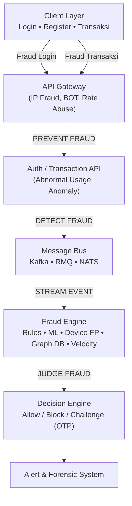
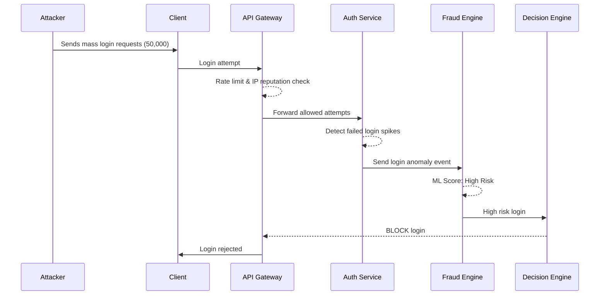
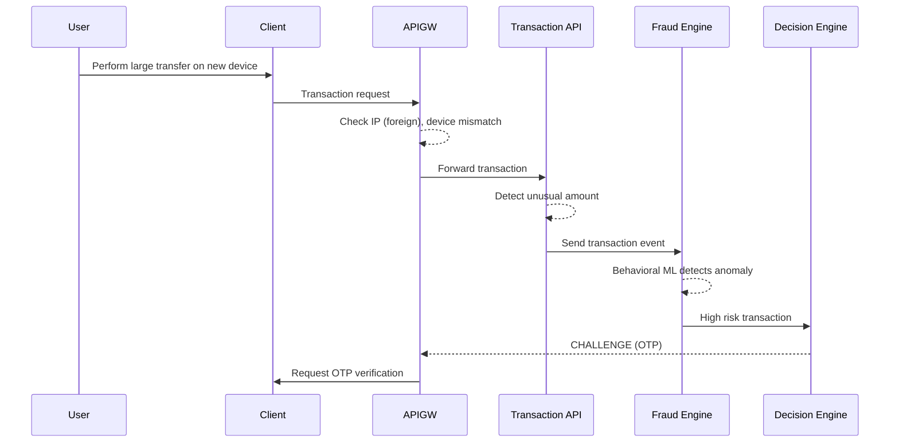
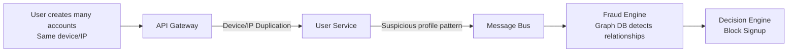

# Fraud Architecture & Detection Flow

Dokumentasi ini menjelaskan area di mana fraud terjadi, alur deteksi anti-fraud, dan real case yang terjadi pada sistem login, transaksi, dan abuse.

---

# 1. Area Terjadinya Fraud & Arsitektur Anti-Fraud

---

# 2. Real Case – Credential Stuffing (Login Fraud)

Penyerang menggunakan 50.000 email/password bocor untuk mencoba login secara otomatis.

## Diagram (Login Fraud)

### Dimana Fraud Terjadi:

* Client (login form)
* API Gateway (IP/bot spikes)
* Auth API (failed login abnormal)
* Fraud Engine (risk scoring)

---

# 3. Real Case – Account Takeover (Transaksi Tidak Wajar)

Akun pengguna dibajak, lalu penipu melakukan transfer besar dari device baru di luar negeri.

## Diagram (Transaction Fraud)

### Dimana Fraud Terjadi:

* Client → transaksi tidak wajar
* Gateway → IP luar negeri
* Transaction API → jumlah abnormal
* Fraud Engine → ML anomaly detection

---

# 4. Real Case – Bonus Abuse / Multi-Account Fraud

Pelaku membuat puluhan akun palsu untuk mendapatkan welcome bonus berkali-kali.

## Diagram (Abuse)

### Dimana Fraud Terjadi:

* Client → pendaftaran akun banyak
* Gateway → device/ip duplication
* User API → profil duplikasi
* Fraud Engine → Graph DB (fraud ring)

---

# 5. Ringkasan Fraud & Solusi

| Real Fraud Case         | Dimana Terjadi           | Solusi Anti-Fraud                          |
| ----------------------- | ------------------------ | ------------------------------------------ |
| **Credential stuffing** | Login, Gateway, Auth API | Rate limit, IP scoring, MFA, bot detection |
| **Account takeover**    | Login + Transaksi        | Device fingerprint, GeoIP, OTP             |
| **Bonus abuse**         | Register                 | Graph DB, device duplication check         |
| **Payment fraud**       | Payment API              | Card BIN check, 3DS, rules engine          |

---